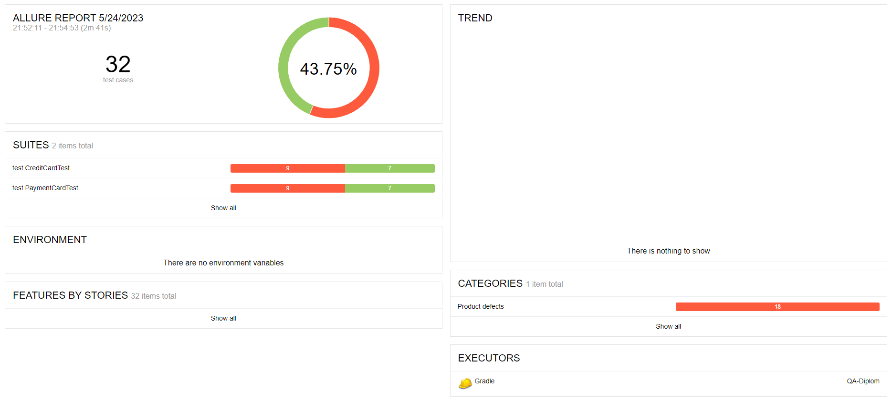
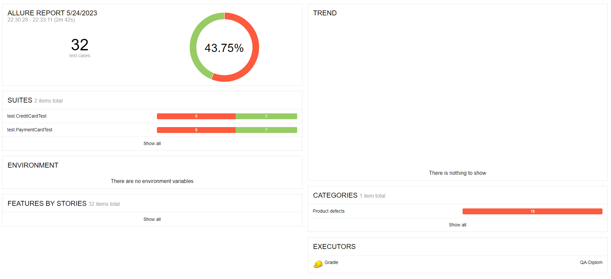

# Отчет по тестированию

### С использованием MySQL:
#### Количество тест-кейсов: 32
* успешных: 14 (43.75%)
* неуспешных: 18 (56.25%)
  

### С использованием PostgreSQL:
#### Количество тест-кейсов: 32
* успешных: 14 (43.75%)
* неуспешных: 18 (56.25%)
  